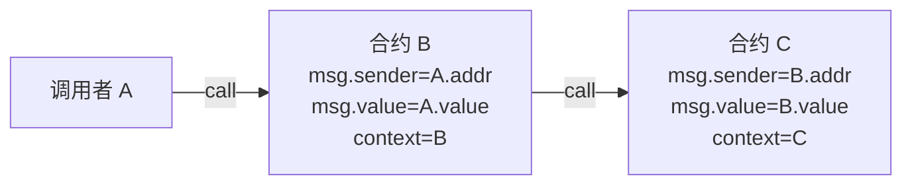
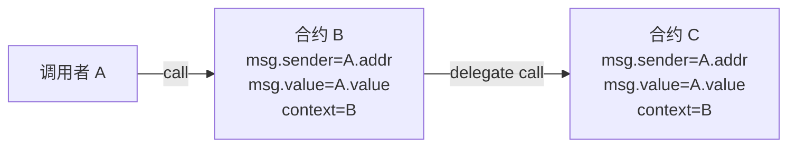

# delegateCall

## call & delegateCall

### call

> context: 包含状态及变量的环境，状态变量更改产生的效果，会作用在此环境上

### delegateCall

### delegateCall 应用场景

- 代理合约(Proxy Contract): logic contract 与 proxy contract 有着相同的变量定义，proxy contract 存储变量，但变量的更改是由 logic contract 中的方法来改变的
