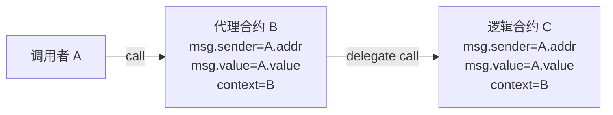
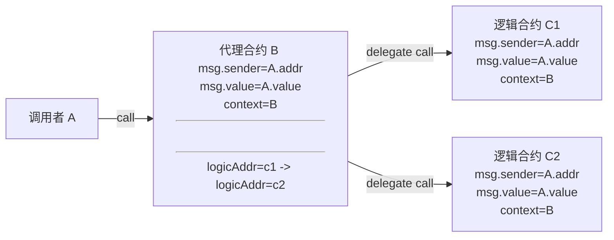

- [合约的升级](#合约的升级)
    - [可升级代理](#可升级代理)
    - [透明代理](#透明代理)
    - [通用可升级代理(UUPS)](#通用可升级代理uups)
    - [总结](#总结)

# 合约的升级

在谈合约的升级之前，先来看看代理合约的知识

### 可升级代理

### 透明代理

智能合约中，函数选择器（selector）是函数签名的哈希的前4个字节。例如`mint(address account)`的选择器为`bytes4(keccak256("mint(address)"))`，也就是`0x6a627842`，由于由于函数选择器仅有4个字节，范围很小，且代理合约和逻辑合约是 2 个不同的合约，是会可能存在这 2 个合约的方法计算出的 `method_id` 相同，即所谓的选择器冲突。当出现选择器冲突时，如果逻辑合约的 a 函数与代理合约的 upgrade 函数，正好出现了选择器冲突，那么当管理员调用逻辑合约的 a 函数时，实际会调用 upgrad 函数，将代理合约升级成了一个黑洞合约，造成不堪设想的后果

基于以上可升级代理合约存在的函数选择器冲突问题，衍生出了透明代理方案。简单来说，选择器冲突是客观存在且无法避免的，但却是由于管理员调用了逻辑合约的方法，导致误调用升级函数出现问题的。那么透明代理的方案也很简单，即限制管理员的权限:

- 管理员变成工具人，可升级函数能且只能由管理员调用，不能够通过回调调用逻辑合约的函数

### 通用可升级代理(UUPS)

基于可升级的代理合约，将升级函数放到逻辑合约之中，利用同一函数中选择器冲突会编译失败的原理，来避免可升级代理存在选择器冲突的问题

### 总结

| 升级方案 | 升级函数在 | 是否会选择器冲突 | 缺点 |
| --- | --- | --- | --- |
| 可升级代理 | Proxy | 会 | 选择器冲突 |
| 透明代码 | Proxy | 不会 | 费 gas（相较而言，增加了权限判断）|
| UUPS | Logic | 不会 | 复杂 |