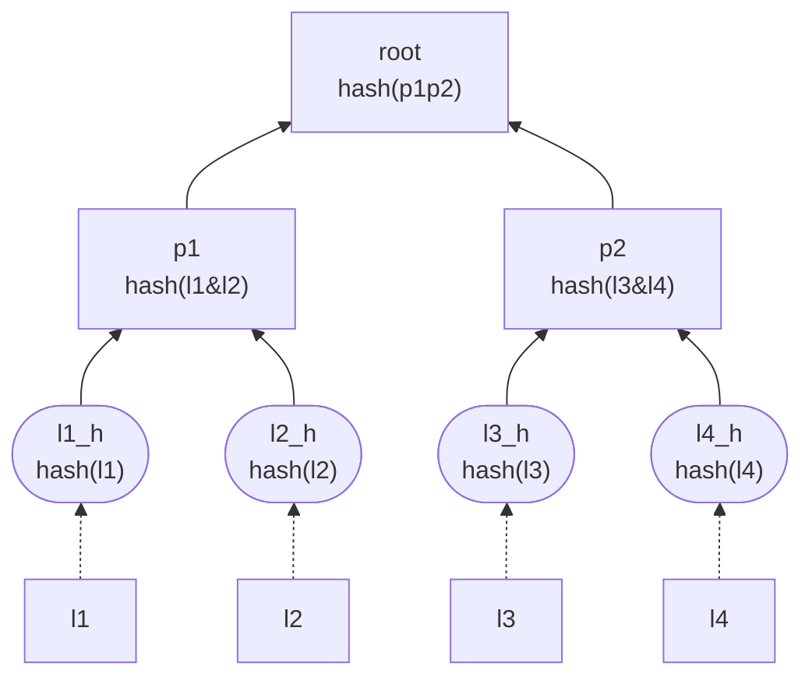

# MerkleTree - 默克尔树
- [MerkleTree - 默克尔树](#merkletree---默克尔树)
  - [什么是 merkle tree](#什么是-merkle-tree)
    - [merkle tree 的原理](#merkle-tree-的原理)
  - [为什么要使用 merkle tree](#为什么要使用-merkle-tree)
  - [如何使用 merkle tree](#如何使用-merkle-tree)
  - [merkle tree 的应用](#merkle-tree-的应用)
  - [Ref](#ref)

## 什么是 merkle tree

merkle tree 又称二分哈希树，在区块链技术中主要用来在不下载完整数据的情况下，验证交易的完整性及真实性；

### merkle tree 的原理

如图，在已知 `root` 值的前提下，只需提供叶子节点(leaf) `l1` 及其 proof [`l2_h`, `p2`]，便可以验证 `l1` 是否在 merkle tree 中

## 为什么要使用 merkle tree

merkle tree 能够利用 merkle proof 实现验证某个元素是否在某个庞大集合中的高效验证，并且能够快速定位被修改的叶子节点。

## 如何使用 merkle tree

1. 为元素集合生成 merkle tree: 使用在线[网页](https://lab.miguelmota.com/merkletreejs/example/)或者 `merkletreejs` 来生成 merkle tree
2. 提供待验证的叶子节点及其 proof 来验证节点是否在 merkle tree 中

在 solidity 合约中，项目方通常使用 merkle tree 来实现`白名单空投`(需要判断调用者是否在白名单中)

## merkle tree 的应用

1. 验证元素是否在一个集合中
2. 比较两个集合是否相同: 只需比较两个集合生成的 merkle tree 的 root 值是否相同
3. 快速定位集合中，哪些元素被修改了
4. 零知识证明: 不需要给出完整集合数据，只需要根据某个叶子节点及其 proof 值，便可验证节点是否存在集合中

## Ref

- [MerkleTree](https://www.wtf.academy/docs/solidity-103/MerkleTree/)
- [MerkleTree-02](https://yeasy.gitbook.io/blockchain_guide/05_crypto/merkle_trie)

